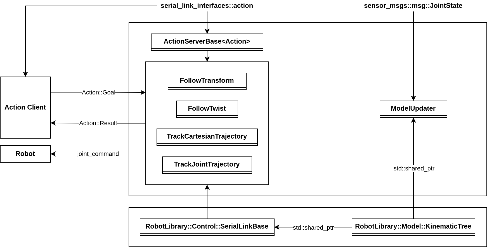
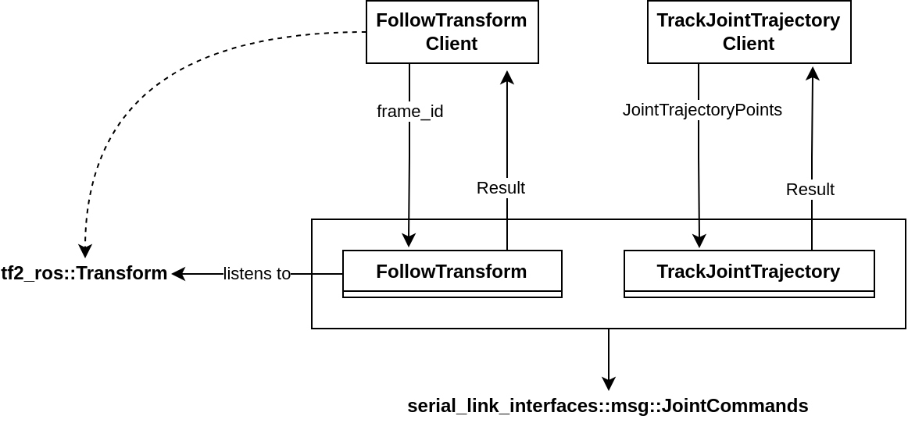
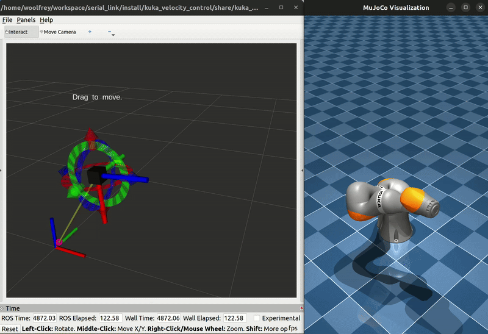
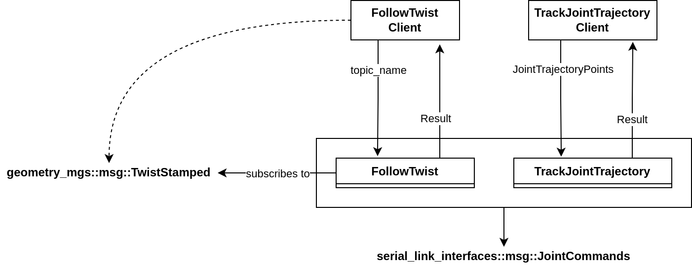
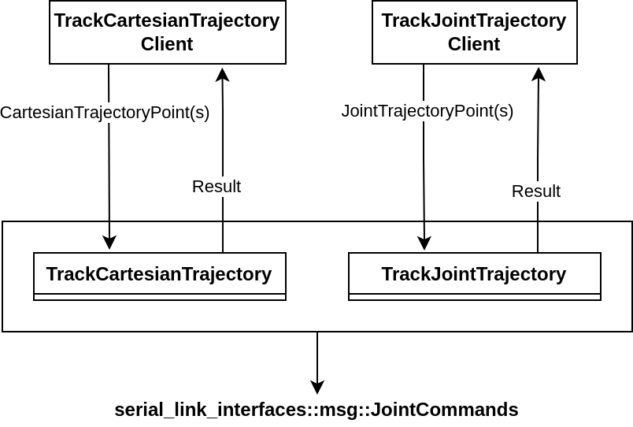

# :cartwheeling: Serial Link Action Server

This package contains [ROS2 action servers](https://design.ros2.org/articles/actions.html) defined in the [serial link interface package](https://github.com/Woolfrey/interface_serial_link), using [Robot Library](https://github.com/Woolfrey/software_robot_library) for the underlying control algorithms.

#### :sparkles: Features:
- Real-time control of serial link robot arms,
- Joint space & Cartesian control,
- Seemless integration with the [serial link action client](https://github.com/Woolfrey/client_serial_link) package, and
- Classes for implementing your own custom control algorithms.

#### :compass: Navigation
- [Requirements](#clipboard-requirements)
- [Installation](#floppy_disk-installation)
- [Classes](#card_file_box-classes)
- [Nodes](#satellite-nodes)
- [Release Notes](#package-release-notes---v100-april-2025)
- [Contributing](#handshake-contributing)
- [License](#scroll-license)

## :clipboard: Requirements

- [Ubuntu 22.04](https://ubuntu.com/blog/tag/22-04-lts), or later,
- [ROS2 Humble](https://docs.ros.org/en/humble/index.html), or later,
- [RobotLibrary](https://github.com/Woolfrey/software_robot_library), and
- The [serial link interfaces](https://github.com/Woolfrey/interface_serial_link) package.

> [!NOTE]
> This package was built and tested using Ubuntu 22.04, and ROS2 Humble.

## :floppy_disk: Installation

Your directory structure should end up looking something like this:
```
ros2_workspace/
├── build/
├── install/
├── log/
└── src/
    ├── interface_serial_link/
    └── server_serial_link/
        ├── doc/
        ├── include/
        ├── src/
        ├── CMakeLists.txt
        ├── LICENSE
        ├── package.xml
        └── README.md
```

1. In the `src/` directory of your ROS2 workspace, clone the interfaces repository:

```
git clone https://github.com/Woolfrey/interface_serial_link.git
```

2. Clone the action server repository:

```
git clone http://github.com/Woolfrey/server_serial_link.git
```

3. Navigate back to the root of your ROS2 workspace and build:

```
colcon build
```

4. Source the local directory (if you haven't yet altered your .bashrc file):

```
source ./install/setup.bash
```

5. Check successful installation:

```
ros2 pkg list
```
   
If you scroll down the list, you should see both `serial_link_action_server`, and `serial_link_interfaces`.

[:top: Back to Top.](#cartwheeling-serial-link-action-server)

## :card_file_box: Classes

This package contains several classes that implement action servers for the actions specified in the [interface repository](https://github.com/Woolfrey/interface_serial_link). The diagram below shows how the classes and nodes are organised in an executable to control a robot:

<p align="center">
    
</p>

- A `RobotLibrary::Model::KinematicTree` object is used to compute the forward kinematics & inverse dynamics of the robot.
- A `ModelUpdater` node subscribes to a `sensor_msgs::msg::JointState` topic and update the `KinematicTree` as messages are received.
- A `RobotLibrary::Control::SerialLinkBase` object uses the model to control a branch on the `KinematicTree`.
- The `ActionServerBase` is a templated class that provides a standardised structure & interface for all derived classes.
- The derived classes, e.g. `FollowTransform`, `FollowJointTrajectory`, use the `SerialLinkBase` object to implement the control loop in order to perform the desired action.

[:top: Back to Top.](#cartwheeling-serial-link-action-server)

## :satellite: Nodes

This package contains nodes with pre-configured actions that you can use. Of course, you can easily make your own, and mix-and-match different actions to suit your own task. Just follow the diagram above, or check how the nodes are written in the `src/nodes/` directory.

Each executable requires 4 arguments:
1. A path to a valid URDF file,
2. The name of the endpoint link to be controlled,
3. The name of the topic to publish the `serial_link_interfaces::msg::JointCommand` message, and
4. The name of the `sensor_msgs::msg::JointState` topic to subscribe to.

There is also parameters for the `RobotLibrary::Control::SerialLinkBase` that can be loaded via a `.YAML` file:

```
/**:
    ros__parameters:

        # These are for the RobotLibrary::Control class(es):
        cartesian_damping: [10.0,  0.0,  0.0, 0.0, 0.0, 0.0,
                             0.0, 10.0,  0.0, 0.0, 0.0, 0.0,
                             0.0,  0.0, 10.0, 0.0, 0.0, 0.0,
                             0.0,  0.0,  0.0, 1.0, 0.0, 0.0,
                             0.0,  0.0,  0.0, 0.0, 1.0, 0.0,
                             0.0,  0.0,  0.0, 0.0, 0.0, 1.0]
        cartesian_stiffness: [200.0,   0.0,   0.0,   0.0,   0.0,   0.0,
                                0.0, 200.0,   0.0,   0.0,   0.0,   0.0,
                                0.0,   0.0, 200.0,   0.0,   0.0,   0.0,
                                0.0,   0.0,   0.0, 100.0,   0.0,   0.0,
                                0.0,   0.0,   0.0,   0.0, 100.0,   0.0,
                                0.0,   0.0,   0.0,   0.0,   0.0, 100.0]
        frequency: 500.0
        joint_position_gain: 50.0
        joint_velocity_gain:  10.0
        manipulability_threshold: 0.001
        max_joint_acceleration: 10.0

        # These are for the underlying QPSolver class:
        initial_barrier_scalar: 500.0
        barrier_reduction_rate: 0.001
        step_size_tolerance: 0.05
        max_steps: 10
```

The best way to run the node is using a launch file, for example `trajectory_tracking.py` might look like:

```
import os
from launch import LaunchDescription
from launch_ros.actions import Node

def generate_launch_description():

    trajectory_tracking = Node(
        package    = 'serial_link_action_server',
        executable = 'trajectory_tracking_server',
        name       = 'trajectory_tracking_server',
        output     = 'screen',
        parameters = ['config/control_parameters.yaml')],
        arguments  = ['urdf/robot.urdf'),                     # URDF location
                     'end_effector',                          # Endpoint name
                     'joint_commands',                        # Topic to publish joint commands to
                     'joint_state']                           # Joint state topic to subscribe to
    )

    return LaunchDescription([trajectory_tracking])
```

### Follow Transform Server

This node contains the `FollowJointTrajectory` action, so you can move the robot in to different joint configurations, and the `FollowTransform` action. With the latter, you use a corresponding client to tell the server the `frame_id` of a `tf2_ros::Transform` that is broadcast somehow over the network. The server listens for this transform, and performs feedback control to align the robot endpoint pose with it.

<p align="center">
    
</p>

<p align="center">
    
</p>


### Follow Twist Server

This node contains the `FollowJointTrajectory` action, so you can move the robot in to different joint configurations, and the `FollowTwist` action. Using the latter's matching client, you send a goal with the topic name for a `geometry_msgs::msg::TwistStamped` message that is being published somehow over the ROS2 network. The action client will subscribe to this topic, and move the endpoint of the robot at the given speed.

<p align="center">
    
</p>

<p align="center">
    
</p>


### Track Trajectory Server

This node contains the `FollowJointTrajectory` action, and the `FollowCartesianTrajectory` action. Using the former, you can move the robot in to different joint configurations. Using the latter, you can make the endpoint follow a trajectory defined by a series of `serial_link_interfaces::msg::CartesianTrajectoryPoint`s. The actions erver takes these waypoints and fits a spline to them, and performs feedback control to follow it.

<p align="center">
    
</p>

<p align="center">
    
</p>

[:top: Back to Top.](#cartwheeling-serial-link-action-server)

## :package: Release Notes - v1.0.0 (April 2025)

### :tada: First Release:

**Classes:**
- ActionServerBase (templated)
- FollowTransform
- FollowTwist
- ModelUpdater
- TrackCartesianTrajectory
- TrackJointTrajectory

**Nodes:**
- follow_transform_server
- follow_twist_server
- track_trajectory_server
 
[:top: Back to Top.](#cartwheeling-serial-link-action-server)

## :handshake: Contributing

Contributions are always welcome. Feel free to fork the repository, make changes, and issue a pull request.

You can also raise an issue asking for new features.

[:top: Back to Top.](#cartwheeling-serial-link-action-server)

## :scroll: License

This software package is licensed under the [GNU General Public License v3.0 (GPL-3.0)](https://choosealicense.com/licenses/gpl-3.0/). You are free to use, modify, and distribute this package, provided that any modified versions also comply with the GPL-3.0 license. All modified versions must make the source code available and be licensed under GPL-3.0. The license also ensures that the software remains free and prohibits the use of proprietary restrictions such as Digital Rights Management (DRM) and patent claims. For more details, please refer to the [full license text](LICENSE).

[:top: Back to Top.](#cartwheeling-serial-link-action-server)
